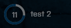

# VU-Killstreak
Core mod for Killstreaks in Battlefield 3.

This mod adds the UI and the logic to interact with killstreaks.
The UI is made with React. To develop you need NodeJS and npm installed on you System.
On first use go into the UI Folder and type in the command line "npm install" to install all dependencies
then you can run the UI on your local System with "npm run start"

> Killstreaks will be provided as extra mods. See here how you [create one](#develop-killstreaks)


## Available killstreaks:
> Killstreaks only work if you load them in the ModList.txt
- [Artillery Strike](https://github.com/Maxinger15/vu-artillerystrike)
- [Tactical Missle (WIP)](https://github.com/Maxinger15/vu-tactical-missle)

## Develop killstreaks:

### Defaults:
The default keys to trigger the killstreaks are F5,F6 ,F7 ,F8.
It is possible to change this in the configuration.lua but it would be more instinctively to keep the defaults.
The default key to trigger the killstreak if it has a UI (for example when you can place it at a location) the
default key should be F.

### Events:
Your killstreak needs the following Events at the client side to be used by the core mod.

The <your mod name in mod.json>:Invoke event is triggerd when the User has the points to use your killstreak
and pressed the declared button in the configuration.lua
Parameters:
- stepNr: The number of your killstreak (1-4 including)
- keyboardKey: The key the user pressed to invoke your killstreak
> ```lua
>Events:Subscribe("<your mod name>:Invoke",function(stepNr,keyboardKey)
>	-- Killstreak enabled. Enable UI if available
>    Do things the killstreak should do
>end)
> ```

The <your mod name in mod.json>:Disable event is only necessary if you have a step between
invoke killstreak and actually use it. A UI where you can select a place for example. See [this](https://github.com/Maxinger15/vu-artillerystrike)
> ```lua
> Events:Subscribe("<your mod name>:Disable",function(stepNr)
>	-- Killstreak not Used. Disable UI....
> end)
>```
  
The Killstreak:newTimer event allows you to show a timer at the UI

The timerObj needs the following properties:
- duration: number - time to tick in seconds
- text: text displayed at the UI (best letters < 25 but not limited)
> ```lua
> Events:Dispatch("Killstreak:newTimer", timerObj)
>```
  
Dispatch this event when the killstreak was used.
This decreases the points of the player and adjusts the UI
Parameter:
- stepNr: the stepNr you got with the invoke event.
> ```lua
> Events:Dispatch("Killstreak:usedStep",stepNr)
> ```
# Configuration
## Server
In the Server folder you can find this configuration files.
### Configuration.lua
In this file you define which killstreak mods are available, how many points they cost, change the selection keys (not recommended!)
Currently only 4 killstreaks at the same time are supportet!!! Not more not less!
The file looks like that:
>```lua
>local conf  ={
>{
>        "vu-artillerystrike", -- name from the mod.json of the killstreak
>        InputDeviceKeys.IDK_F5, !!deprecated ! don't use !! -- key to trigger the killstreak
>        150, -- the cost of the killstreak (can/should be changed)
>        "Grenades", -- The name that is shown in the UI
>        "Left %NR", -- The description that is shown in the UI.
>        "F5", -- shown in the circle at the UI
>        "Press F to use", -- replaces the description when the killstreak is ready to use
>      },
>      {
>        "vu-artillerystrike",
>        65,
>        250,
>        "Health",
>        "Left %NR",
>        "F5",
>        "Press F to use",
>      },
>      ...
>}
>```
Fancy thing: %NR will be replaced by the UI with the points left to unlock the killstreak. "Left: %NR Points" -> "Left: 150 Points"

### settings.lua
Here you can change the mechanics of the mod.
> local setting = {
>    resetOnDeath = false; -- resets the points of the player to 0 if he dies
>    ignoreScoreInVehicle = false; -- ignores all points a player get if he is in a vehicle 
> }

## Client
### keybindings.lua
Here you can define which keys are used to trigger the killstreak-mod execution.
The basic key to use the killstreak after that is F9
>local bindings = {
>    InputDeviceKeys.IDK_F5,InputDeviceKeys.IDK_F6,InputDeviceKeys.IDK_F7,InputDeviceKeys.IDK_F8
>}

Get your values from [here](https://docs.veniceunleashed.net/vext/ref/fb/inputdevicekeys/)
